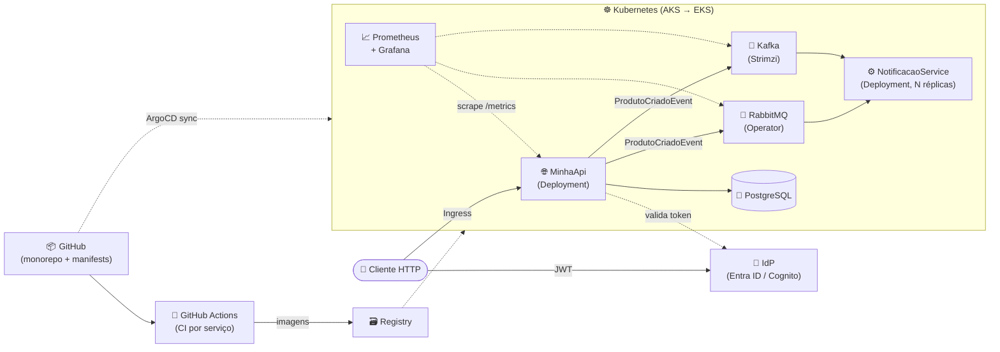

# 🗺️ Roadmap de Evolução — dotnet-microservice-template

> **Missão:** evoluir, passo a passo, de uma API com mensageria didática para uma
> **arquitetura de microsserviços completa e funcional** — monorepo, CI/CD por serviço,
> Kubernetes com GitOps (ArgoCD) e deploy real na **Azure** e depois na **AWS**.
>
> Cada fase é pequena, executável e ensina um conceito de produção de verdade.

---

## 📍 Onde Estamos (✅ concluído)

| Entrega | Status |
|---|---|
| Minimal API .NET 8 + EF Core (SQLite) + DDD tático + Vertical Slices | ✅ |
| RabbitMQ: publish (MassTransit), consumidor, fila `produto-criado` | ✅ |
| Kafka (KRaft): producer e consumidor Confluent.Kafka, tópico `produtos-criados` | ✅ |
| Rotas de monitoramento: `GET /api/filas/rabbitmq` e `GET /api/filas/kafka` (lag, offsets, históricos) | ✅ |
| Logs didáticos 📤/📥 para acompanhar publish/consume em tempo real | ✅ |
| Docker Compose com 4 containers e healthchecks (API, RabbitMQ, Kafka, Kafka UI) | ✅ |

**Diagnóstico honesto:** a mensageria está completa, mas publisher e consumidor vivem
no mesmo processo. O conceito central de microsserviços — **desacoplamento entre
serviços com deploy independente** — é exatamente o que as próximas fases entregam.

---

## 🧭 Princípios que Guiam o Projeto

1. **Monorepo ≠ monolito.** Microsserviço é independência de *deploy e execução*, não de repositório. Um repo, vários serviços, **uma pipeline por serviço** (path filters).
2. **Compartilhar apenas contratos.** A lib `Contratos/` contém só os eventos (records puros). Domínio e lógica de negócio nunca são compartilhados — isso evitaria o pior dos mundos: o monolito distribuído.
3. **Banco por serviço.** Serviços conversam apenas via broker, nunca via banco.
4. **A imagem é o artefato universal.** O mesmo Dockerfile serve para compose (dev) e Kubernetes (produção). O compose é a "infraestrutura emulada" local.
5. **Tudo deve ser visível.** Logs, rotas de monitoramento e painéis em cada fase — se não dá para *ver* funcionando, não está pronto.

---

## 🧑‍💻 Estratégia de Ambientes (Developer Experience)

> **Regra de ouro:** local fica só o que você está *iterando*; nuvem fica o que é
> *compartilhável e pesado*. Rodar a plataforma inteira no notebook é troféu de
> aprendizado — não requisito para trabalhar. O ambiente precisa funcionar em
> qualquer máquina do time, não só na mais parruda.

| Ambiente | Onde roda | O que contém | Custo |
|---|---|---|---|
| **🖥️ Inner loop** (dia a dia) | Máquina do dev (~8 GB basta) | O serviço em edição com `dotnet watch` + compose enxuto: brokers (Kafka com heap reduzido) e banco | R$ 0 |
| **☁️ Dev compartilhado** (outer loop) | Cluster pequeno na nuvem — **um para o time inteiro** | Kubernetes + ArgoCD + Grafana + Keycloak + serviços integrados; isolamento por *namespace* (por dev/feature) | ~US$ 30–60/mês com auto-shutdown |
| **🧪 Sandbox local completo** (opcional) | k3d/kind no Docker | Cluster + ArgoCD + stack inteira local — exercício de aprendizado da Fase 9 | R$ 0 (exige ~9 GB livres) |

Decisões que sustentam essa estratégia:

- **AKS free tier**: o control plane custa zero — paga-se só os nós. Ambiente dev não roda 24/7: auto-shutdown à noite/fim de semana corta ~70% da conta.
- **ArgoCD mora no cluster dev** (faz *pull* do GitHub; o time só abre a UI no navegador).
- **mirrord / Telepresence**: pluga o processo local (`dotnet watch`) na rede do cluster remoto — hot reload local conversando com a infraestrutura real. O melhor dos dois mundos, e o motivo de times grandes terem abandonado o "sobe tudo local".
- Para estudo solo antes do time existir: uma única VM com k3s (~US$ 15–25/mês com auto-stop) roda o papel do cluster dev.

---

## 🚀 Próximas Features (em ordem)

### Fase 4 — Monorepo + Segundo Serviço (o desacoplamento real)

*O passo mais valioso: extrair o consumidor para outro processo, outro container, outro deploy.*

```text
dotnet-microservice-template/
├── docker-compose.yaml              # orquestra tudo (raiz)
├── .github/workflows/
│   ├── minha-api.yml                # CI com filtro de path
│   └── notificacao-service.yml      # CI independente do worker
├── docs/
├── src/
│   ├── MinhaApi/                    # API HTTP (publisher)
│   ├── NotificacaoService/          # worker consumidor (sem HTTP)
│   └── Contratos/                   # class lib: apenas os eventos
└── tests/
```

- [ ] Reestruturar o repo para `src/` (a MinhaApi sai da raiz)
- [ ] Criar `Contratos/` com `ProdutoCriadoEvent` (project reference nos dois serviços)
- [ ] Criar `NotificacaoService` (worker .NET) consumindo RabbitMQ e Kafka
- [ ] CI no GitHub Actions com `on.push.paths` — mexeu só no worker, só o pipeline dele roda
- [ ] **Experimentos:** `docker compose up --scale notificacao-service=2` (rebalanceamento de partições no Kafka); derrubar o worker e ver as mensagens acumulando pela rota de monitoramento

**Conceitos:** deploy independente · consumer groups na prática · contratos versionáveis · CI por serviço

---

### Fase 5 — Resiliência: Retry, DLQ e Idempotência

*"O que acontece quando dá errado?" — a pergunta que separa demo de produção.*

- [ ] Política de retry no MassTransit + observar a fila `_error` (Dead Letter Queue)
- [ ] Endpoint didático que cria um "produto envenenado" para forçar falha no consumidor
- [ ] Idempotência: registrar `MessageId` processados e ignorar duplicatas (entrega *at-least-once* gera duplicatas — sempre)
- [ ] Retry topic no Kafka (padrão de tópicos de retry)

**Conceitos:** at-least-once delivery · DLQ · consumidores idempotentes

---

### Fase 6 — Outbox Pattern (o problema do dual-write)

*Hoje: `SaveChanges()` e depois `Publish()`. Se a aplicação cair entre os dois, o produto existe no banco mas o evento se perdeu para sempre.*

- [ ] Transactional Outbox do MassTransit com EF Core (evento gravado na mesma transação do produto)
- [ ] Demonstrar a falha antes/depois (matar o container no momento certo)

**Conceitos:** consistência eventual · atomicidade banco+evento · garantia de entrega

---

### Fase 7 — Observabilidade, Health Checks e Dashboard (Grafana)

*Pré-requisito direto do Kubernetes (probes) e a base para operar em produção.*

- [ ] `/health/live` e `/health/ready` com `AspNetCore.HealthChecks` (RabbitMQ + Kafka + banco)
- [ ] OpenTelemetry: tracing distribuído com correlation id viajando **dentro da mensagem** — ver o mesmo trace atravessar API → broker → worker
- [ ] Métricas: endpoint `/metrics` (Prometheus) na API e no worker via OpenTelemetry
- [ ] Exporters dos brokers: plugin `rabbitmq_prometheus` (nativo) e Kafka exporter
- [ ] **Prometheus + Grafana no compose**: dashboard com profundidade das filas, lag do consumer group e taxa de publish/consume, com auto-refresh (5–10s)
- [ ] Testes de integração com **Testcontainers** (sobe RabbitMQ/Kafka reais durante o teste)

> 💡 **Decisão de design:** o dashboard de filas será no **Grafana**, não em um frontend
> React/TypeScript próprio. Estado de fila é métrica de infraestrutura: os exporters já
> existem, o refresh periódico é nativo, e não criamos uma aplicação inteira para manter.
> Um frontend customizado só se justificaria para telas de *negócio* — e aí entraria no
> roadmap como um serviço próprio consumindo a API.

**Conceitos:** liveness vs readiness · tracing distribuído · métricas Prometheus · dashboards · testes de integração reais

---

### Fase 8 — Segurança: Autenticação e Autorização (JWT + IdP)

*Proteger as rotas com o mesmo modelo usado em produção: tokens JWT emitidos por um Identity Provider — local primeiro, gerenciado na nuvem depois.*

- [ ] **Keycloak** como container no compose (OpenID Connect) — faz localmente o mesmo papel do Cognito/Entra ID
- [ ] Validação de JWT na API (issuer, audience, assinatura) com `AddJwtBearer`
- [ ] Proteger rotas com policies/scopes (ex.: `produtos:write` para o POST, leitura pública nas rotas de monitoramento)
- [ ] Propagar identidade nos eventos (quem criou o produto viaja na mensagem)
- [ ] **Na nuvem (Fase 10):** trocar o IdP por serviço gerenciado — **Microsoft Entra ID** na Azure, **Amazon Cognito** na AWS — alterando apenas configuração (`Authority`), sem tocar no código. É a prova de que a autenticação está desacoplada.

**Conceitos:** OAuth2/OIDC · JWT (claims, scopes, expiração) · authorization policies · IdP gerenciado vs self-hosted

---

### Fase 9 — Kubernetes + CD com GitOps (ArgoCD)

*Os Dockerfiles são 100% reaproveitados. O compose vira artefato de dev — o cluster usa manifests.*

| docker-compose | Kubernetes |
|---|---|
| `services.meu-backend` | `Deployment` + `Service` |
| `ports: 5000:80` | `Service` + `Ingress` |
| `environment:` | `ConfigMap` + `Secret` |
| `healthcheck:` | `livenessProbe` / `readinessProbe` |
| `depends_on` | não existe — a app reconecta sozinha (MassTransit/Confluent já fazem) |

Ajustes necessários na aplicação:

- [ ] **SQLite → PostgreSQL** (banco no pod morre a cada restart e quebra com réplicas; com EF Core é quase só trocar o provider)
- [ ] Credenciais para `Secret` / variáveis de ambiente (`RabbitMq__Host` etc. — o .NET já suporta nativamente)
- [ ] Manifests ou Helm chart por serviço
- [ ] Brokers via operator (Strimzi para Kafka, RabbitMQ Cluster Operator) ou serviço gerenciado
- [ ] *(Opcional)* Sandbox local completo: cluster **k3d** + ArgoCD rodando no Docker — ver "Estratégia de Ambientes"
- [ ] *(Quando houver cluster dev)* **mirrord/Telepresence**: dev local plugado na infraestrutura remota

Pipeline completa:

```text
push → CI do serviço (path filter) → build + test → imagem → GHCR
     → CD atualiza tag no repo de manifests → ArgoCD sincroniza o cluster 🎯
```

**Conceitos:** probes · GitOps (o cluster observa o repo) · operators · 12-factor config

---

### Fase 10 — Deploy na Nuvem: Azure primeiro, depois AWS ☁️

*A recompensa: a mesma estrutura rodando em cloud de verdade — e a portabilidade comprovada.*

| | 🔷 Azure (primeiro) | 🟠 AWS (depois) |
|---|---|---|
| Kubernetes | AKS | EKS |
| Registry | ACR (ou GHCR) | ECR (ou GHCR) |
| PostgreSQL | Azure Database for PostgreSQL | RDS |
| Identidade (JWT) | Microsoft Entra ID | Amazon Cognito |
| Observabilidade gerenciada (opcional) | Azure Managed Grafana | Amazon Managed Grafana |
| Mensageria gerenciada (opcional) | Azure Service Bus / Event Hubs | Amazon MQ / MSK |

- [ ] Infra como código (Bicep/Terraform na Azure; Terraform na AWS)
- [ ] ArgoCD apontando para o cluster cloud
- [ ] O mesmo GitOps, duas nuvens — provar que a arquitetura é portável

---

## 🔮 Backlog (sem fase definida — quando houver contexto)

- **Performance e carga:** o .NET 8 já entrega throughput excelente por padrão; o assunto fica relevante quando novos componentes/adapters forem plugados. Ferramentas previstas: **k6** ou **NBomber** (teste de carga no fluxo HTTP → broker → worker), **BenchmarkDotNet** (micro-benchmarks) e avaliação de **Native AOT** para o worker.
- **API Gateway (YARP):** quando existirem 2+ APIs HTTP expostas.
- **Versionamento de contratos / Schema Registry:** evolução do `ProdutoCriadoEvent` com consumidores antigos no ar.

---

## 🏁 Arquitetura Final (visão alvo)



---

*Documento vivo — atualizado a cada fase concluída. Última atualização: 2026-06-10 (fases 0–3 concluídas; Fase 8 de segurança, Grafana na Fase 7, backlog de performance e Estratégia de Ambientes adicionados).*
